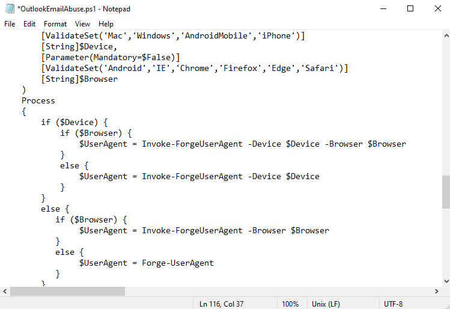

Microsoft Azure Device Code Vishing 101

For the last several years, I have been *loving* this little technique for vishing assessments and
red teams alike. It's (reasonably) straightforward, it costs you $0 for infrastructure setup, on
standard social engineering assessments it delivers some pretty solid business impact for the MBAs
who'll eventually be reading your report, and on red teams it gives you a pretty sick way into your
target environment that can easily be used for data exfiltration or pivoting deeper into the
organization. 

I would be remiss to not start this post by thanking the incredible folks out there who've made all
this possible. First off, [Bobby Cooke / @0xBoku](https://twitter.com/0xBoku) who wrote [this
incredible blog post](https://0xboku.com/2021/07/12/ArtOfDeviceCodePhish.html) that first turned me
on to this awesome technique a few years back. Second, [Steve Borosh / rvrshell](https://github.com/rvrsh3ll), 
the developer who created the TokenTactics tool alongside Bobby that we'll be using today. Finally, 
[Ellis Springe / @knavesec](https://twitter.com/knavesec), a good friend and former co-worker of
mine who first sent me the link to Bobby's blog and told me to figure this technique out for a red
team we were on. 

In this post, I'll be walking through:

1. Setting up TokenTactics
2. Using it to interface with Azure to generate a device login code, and then vishing a user to get them 
to log in with said code
4. Using a mix of TokenTactics and Burp Suite to keep refreshing that token and using it to authenticate as
your targeted user to the Microsoft GraphAPI to start looting their environment/performing additional 
social engineering/doing general red team shenanigans. 

While Bobby's blog and the TokenTactics documentation are pretty great starting points to learn
everything I'll be writing about here, Microsoft has made some changes that break some of the
original techniques outlined in the blog, and this post will mostly be me assembling some of my
notes from recent engagements to streamline figuring out how to work around said changes.

Caveats here include the following:

- I am not an Azure guy
- I am not a Powershell guy
- I am not a webapp guy 
- And yet, we're gonna spend this whole post working with Azure, Powershell, and Burp Suite. My
    walkthrough here is definitely on the hackier side of making things work.

#### Step One: Environment Setup

It's been brought to my attention that through some modern wizardry you can do Powershell things on
Linux. I know nothing about that, so I'm going to keep using a Windows 10 VM in my home lab for all
my Powershell needs. So, through whatever means you prefer (Windows on bare metal/Windows in a
VM/Powershell on Linux/whatever), get yourself a Powershell session. You will want to be running
Powershell as an administrator (again, I'm not a Powershell guy. Is this terrible advice? No idea,
that's why I'm only doing it on my testing VM). You'll also want to go do some hand-to-hand combat
with Windows settings that are there for your "security" or "protection" or some nonsense like that,
go ahead and tell them to stop babying you and allow you to run unsigned scripts locally. This
setting is found by opening the settings menu and navigating to "Update & Security" > "For
Developers" and then scrolling to the bottom, making sure the check box is checked, and clicking
Apply. 

Alright, now in your Powershell window that you ran as an administrator, run the following: 
`Set-ExecutionPolicy Unrestricted -Scope CurrentUser -Force`

We now need to install a few Powershell modules:

- [AzureAD](https://learn.microsoft.com/en-us/powershell/azure/active-directory/install-adv2?view=azureadps-2.0)
- [AADInternals](https://o365blog.com/aadinternals/#installation)
- [TokenTactics](https://github.com/rvrsh3ll/TokenTactics)

I only give good security advice, so go ahead and copy-paste these commands into your Administrator
Powershell session:

    Install-Module AzureAD
    Install-Module AADInternals
    Import-Module AzureAD
    Import-Module AADInternals

Because Powershell does Powershell things, you'll have to re-import the modules every time you open
a new session, but you shouldn't have to reinstall them. Now, let's go get
[TokenTactics](https://github.com/rvrsh3ll/TokenTactics). Go ahead and click on any of the several
times I've linked to the github repo and download it to your Windows machine. **BEFORE YOU INSTALL
TOKENTACTICS**, you'll need to edit one of the files, at least as of 02 May 2024, if you want to
dump the user's Outlook emails directly via Powershell. Honestly, it's probably not necessary, as I
prefer to get the emails via Burp Suite, but I figured I'd include this info anyway. Pop open that
TokenTactics folder in the file explorer and start editing `OutlookEmailAbuse.ps1` in notepad or
something. Ctrl-f for `Forge-UserAgent` and replace every instance with `Invoke-ForgeUserAgent`.
Once you've done that, go ahead and save the file. 

Alright, now we can go ahead and install TokenTactics. Navigate down into those directories you got
from github in Powershell until you're seeing the TokenTactics.psd1 file. At this point, hit 'em with
the old  `Import-Module .\TokenTactics.psd1`. Now you'll be prompted with some security warnings so
just keep hitting 'R' until it stops bothering you. If you've been playing along, you should be
seeing something like this:

Everything from here onward is going to be assuming that your target is actually using Azure
Active Directory. The technique for verifying this hasn't changed at all, so go check out [Bobby's
Blog](https://0xboku.com/2021/07/12/ArtOfDeviceCodePhish.html#aad-reconnaissance) 
and check out the section on AAD Reconnaissance to determine if you should continue to step two. The
tl;dr is that you run `Invoke-AADIntReconAsOutsider -Domain example.com | Format-Table` (obviously
with your target domain instead of example.com) and look at the output, if it says something about
not being registered to Azure AD then you'll have to figure out a plan B.

####Step Two: Code Generation and Delivery

If you compare this blog post to Bobby's side by side, you'll see that after getting those modules
installed he starts on creating some phishing messages that will be used to deliver the device login
code to your target user. Fortunately for the world (but unfortunately for you), spam filters have
gotten pretty good as of late, and it's my understanding that device code phish emails are next to
impossible to land these days since any message with a device code and a link to
[microsoft.com/devicelogin](https://microsoft.com/devicelogin) gets immediately blasted to the ninth
circle of hell. This is why I really prefer using this as a vishing technique (or doing it for some
in-person account takeover as part of physical pentesting). 

Anyway, step two. We need to generate an Azure device login code, which we do with the
straightforward command `Get-AzureToken -Client Graph`. I've experimented with different arguments
to the `-Client` flag like `Outlook` and it's seemed to work the same, but `Graph` is my default.
You should see a nine-character alphanumeric string labeled `user_code` in the output. That's the
code that we need a user to punch in on Microsoft's device login page in order for us to take over
their account. 

The clock is now ticking: you've got 15 minutes before this code expires, and you'll get that
helpful `authorization_pending` notification every five seconds until the user signs in or the code
expires. For this reason, I usually run this once to make sure it's working as expected, ctrl-c, and
then while on the vishing call run it again right before I'm ready to give the user the code, that
way I'm not watching it slowly scroll up the screen throughout the entire call. 

So, what are we even doing on the vishing call? What's the point of this code? 

I mean, I'm assuming you know, since you found and are reading this post, but I'll explain real
quickly using my favorite streaming service as an example: [The Criterion
Channel](https://criterionchannel.com). 

If you want to sign in to the Criterion Channel on an Xbox, you don't type in your email and
password with the Xbox controller because that frankly sucks to do. Instead, the Xbox Criterion app
will query its backend for an activation code which will then be displayed. When you go to
[criterionchannel.com/activate](https://criterionchannel.com/activate) in your browser on your
computer, it'll prompt you first to sign in to your account if you aren't already signed in, then
it'll ask for the activation code displayed on your TV. When you punch in that activation code,
their back end puts together that the app running on $DEVICE was provided the code $CODE, and the
user signed in with $ACCOUNT just provided $CODE to the activation page. Therefore, $ACCOUNT is
trying to sign in on $DEVICE, and $DEVICE should be provided with a token good for accessing The
Criterion Channel as $ACCOUNT for some amount of time. Makes sense, right? Sometimes we want to sign
in to some device that doesn't have great human input options for providing a username and
password, so we offload all that logic to some backend server somewhere and just have the user
handle the sign-in on a device that's a little more user-friendly to type credentials into. 

So now that we're all on the same page about the general idea here, we can address that Microsoft
makes it possible to sign in to your Microsoft account on devices with a similar workflow, via
[microsoft.com/devicelogin](https://microsoft.com/devicelogin). To date, I have found exactly one
(1) device in the wild that actually used this, some kind of vaguely smart conference room phone
that would allow you to sign in and it would pull in your calendar and upcoming teams meetings and
the like to make joining your calls from the room speakers/microphones/cameras/television easier.
What we need to do is convince a user that they need to input the code that we'll provide them into
Microsoft's device login page, and just like that smart conference phone, we'll be provided with a
token (a couple tokens, technically) that allow us to simply be that user as far as Azure, GraphAPI, and
other Microsoft online services are concerned. What's really great about this technique is because
the user handles all that credential-based signing in on their computer (usually well before we call
them; who *isn't* signed in to Microsoft in their work computer's browser?), we don't need to worry
about multi-factor authentication, like, at all. It's simply a non-issue, since the user dealt with
MFA when they logged in in their browser. Additionally, why would they ever suspect that this site
is suspicious? We're literally sending them to a page on microsoft.com. The following page, to be
precise:

Right, so, how do we convince users to 1) go to this page, 2) put in the code we give them, and 3)
approve the sign in? There's a couple of vishing pretexts I've used in the past to pretty solid
effect, but my favorite is claiming to be resolving Microsoft Office License Key issues. Figuring
out the entire pretext for yourself will be left as an exercise to the reader, but calling users and
claiming that there's an issue with their license for Office provides a natural segue into sending
them to a Microsoft page and typing in a "license key". I'm not sure if this is just baked in to the
guts of TokenTactics, but the login flow will always ask users if they're trying to sign in to
Microsoft Office. Maybe that's something that can be changed, maybe that's a universal constant, who
knows. All I know is that it's pretty easy to tell users that there's a problem with a Microsoft
thing so just type this code into Microsoft's website. The following images show the login flow from
the user's POV. First, they enter the code.

Next, they'll sometimes be asked for their Microsoft account. In my experience, if they're already
logged in, it won't usually pop this box up. Sometimes it will anyway, but then it will proceed
without asking for a password/MFA. Of course, if they aren't logged in, they'll have to go through
their standard login flow of providing a username, then a password, and then optionally MFA.

One more click here, at this point you should see why I like to say that we're dealing with an issue
with Microsoft Office. That said, I've been able to pull this off by claiming that we're
troubleshooting some kind of smart device that's supposed to tie in to Microsoft accounts, so just
get creative. 

And that's it. At this point the user is seeing this:

And you should be seeing this:

Great. All their base are belong to you, you're winner, etc. Now's when the fun *really* begins

####Step Three: Looting, persistence, and other shenanigans

Alright, now it's time to start hitting the GraphAPI to do fun things. I'm going to include a few of
my go-to API calls here, but you can really do [just about anything you can find in the GraphAPI
documentation.](https://learn.microsoft.com/en-us/graph/overview). Your specific pentest or red team
might call for specific flags that you can capture directly with the API (pulling sensitive files
from Sharepoint, say) or perhaps you'll need to utilize this access to pivot deeper into the
environment. 

Before we can start hitting the API, we'll need to make sure we have a valid token. The easiest way
to do this is to pop back into your Powershell session and run the following:

    Invoke-RefreshToMSGraphToken -refreshToken $response.refresh_token -domain example.com -Device
    iPhone -Browser Safari | Tee-Object MSGraph.txt

In the TokenTactics documentation and Bobby's blog post, they talk about forging the user agent
string to appear to be Safari on an iPhone since sometimes phones can slip through certain
conditional access policies. I can't say for certain if there's any particular platform or browser
that works more often than others, but to be honest this is just the command I have in my Powershell
history and it's worked so far, so why change it up? I've played with sending other platforms in the
past but in general if this attack is going to work, it seems to work with whatever user agent
string you want to send, and if it isn't going to work it doesn't matter what kind of device you
claim to be. That said, your mileage may vary. Anyway, this command will produce some output in your
console as well as in the file MSGraph.txt for easy exporting to another testing machine if you so
choose (I immediately transfer it to my Linux testing machine where I have Burp Suite installed and
configured the way I like). What we want from this output is that access_token. Go ahead and grab
that (sans white space, sending it through `tr -d "[:space:]"` is your friend). We now take that
access code on its own. Go ahead and open up Burp Repeater, set your target to
[graph.microsoft.com](https://graph.microsoft.com) (make sure you set it to use HTTPS and port 443)
and craft your requests as follows:

    GET {endpoint} HTTP/2
    Host: graph.microsoft.com
    Authorization: Bearer {long access token here}
    Content-Length: 2

And that's about it, hit whichever of the GraphAPI endpoints you care to and include that access
token as part of the Authorization header. In this screenshot, we're requesting all of the calendars
a user has access to.

This post is rambling enough as it is, so I'm not going to go super deep on all the requests you can
make here. Reading the API documentation is intentionally being left as an exercise for the reader.

That said, here's a couple that I like to use. [This first one will upload simple files to the user's
Sharepoint/OneDrive.](https://learn.microsoft.com/en-us/graph/api/driveitem-put-content?view=graph-rest-1.0&tabs=http)

    PUT /v1.0/me/drive/root:/FileNameHere.txt:/content HTTP/2
    Host: graph.microsoft.com
    Authorization: Bearer {token goes here}
    Content-Type: text/plain

    This line and onwards will be uploaded as the file contents of FileNameHere.txt to the user's root onedrive folder.
    What if you decided to do something sneaky and upload your shellcode or C2 implant here?
    Then you could get users to download and run your payload from their own internal organization
    Sharepoint. 

For the sake of space, in future examples I'll be leaving out the Host/Authorization/Content-Type/etc.
headers. You should still include them, but apparently
I'm paying for this blog's hosting fees per line of text, so I'll keep things brief. 

[Here's the request to get a list of the user's email
messages](https://learn.microsoft.com/en-us/graph/api/user-list-messages?view=graph-rest-1.0&tabs=http)

    GET /v1.0/me/messages

Once you have a list of message IDs, you can start using this call to get the MIME content of each
message, which allows you to select everything in the Burp response (save for a couple headers at
the very top) and save it as something like "stolenEmail.eml" and then open it for properly rendered
local viewing in your mail client of choice (I recommend Thunderbird). 

    GET /v1.0/me/messages/{id}/$value

There's some other ways to get messages but I find this to be the cleanest and easiest to get nice
screenshots of properly rendered messages. Can you say "business impact"? The c-levels who don't
know or care what the hell a "Graph API" is will definitely care when your red team report includes
screenshots of compromised emails. It's worth noting that the reason I'm pulling emails this way
instead of doing the Substrate.office.com technique that Bobby includes in his blog post is because
Microsoft made some changes on their end to prevent bad actors with these tokens from being able to
access someone's account via the Outlook online web page. There's literally no change to the end
result, you can still do literally everything with this API, you just have to do it in a slightly
more clunky way than the smooth and polished Outlook online interface. 

Next, how about looting OneDrive? [First, get the user's OneDrive drive ID](https://learn.microsoft.com/en-us/graph/api/drive-get?view=graph-rest-1.0&tabs=http):

    GET /me/drive

You can now [use that drive ID and the item IDs of the folders within the drive to start listing out
files](https://learn.microsoft.com/en-us/graph/api/driveitem-list-children?view=graph-rest-1.0&tabs=http):

    GET /drives/{drive-id}/items/{item-id}/children

In each of the items within the drive (or child folders thereof) you'll see something tagged as
"@microsoft.graph.downloadUrl". Switch Burp Suite tabs to the proxy, disable intercept, open the
browser, and copy/paste in that URL. You'll immediately download the file. Literally the only
downside I've found to exfiltrating data  this way is that the item will be bumped up to the top of the
user's "Recent Items" folder, so be careful if you're looting stuff that's particularly old and
might tip them off. That said, I've never had an issue with it. 

As you're looting and snooping around, you may find that suddenly you're getting 401 Unauthorized
responses in Burp. Have no fear, you should also be seeing a message that says "Lifetime validation
failed, the token is expired." Simply go back to Powershell, re-run that
`Invoke-RefreshToMSGraphToken` command, and resume your activities with your new access_token. 

At this point, just start digging through the GraphAPI docs looking at all the fun stuff you can do.
I know I've just barely scratched the surface here, because I've only really scratched the surface
of this technique's potential myself.

This more or less concludes my walkthrough of utilizing TokenTactics and the GraphAPI to turn
(pretty simple) vishing calls into pretty complete account takeover. To my fellow red teamers, good
luck and have fun. Let me know if you score any cool compromises with these techniques or come up
with some elaborate new vishing pretexts. To my friendly blue teamers, talk to your employees about
device code vishing... before we do ;). 

Tags: social-engineering, vishing, azure, burp-suite
